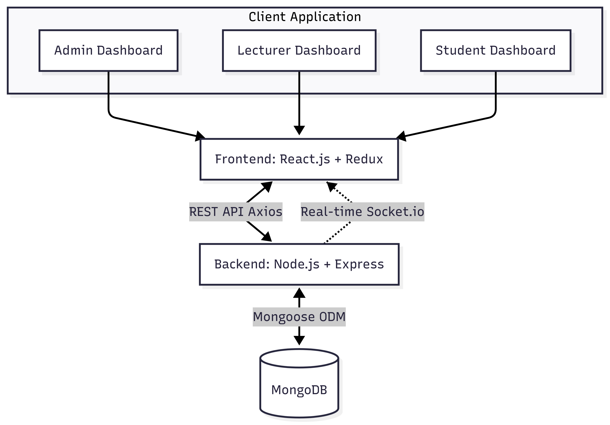
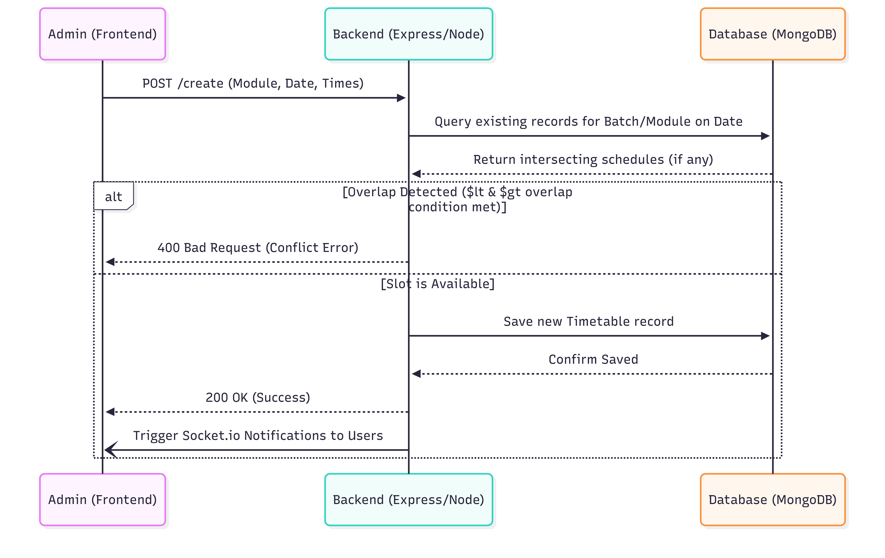

---

# 🗓️ The Scheduler - Smart University Timetable Management System

> **Repository Links:**
> * ⚙️ **Backend Repository:** [Backend Repository](https://github.com/dileeshan-kosa/Updated_timetableschedule_backend.git)
> * 🖥️ **Frontend Repository:** [Frontend Repository](https://github.com/dileeshan-kosa/Updated_timetableschedule_frontend-.git)

## 1. Project Overview

The Smart University Timetable Management System is a comprehensive, Role-Based Access Control (RBAC) web application designed to streamline academic scheduling. Built using the MERN stack, it serves as a centralized hub where administrators can securely create and manage users, map academic modules to lecturers, allocate physical lecture halls, and generate dynamic timetables. The system utilizes a custom backend algorithm to prevent scheduling overlaps and leverages real-time sockets to instantly notify students and lecturers of any timetable changes.

## 2. Core Features

**🔒 Admin Privileges (Central Controller)**

* **User Management:** Create and securely store Lecturer and Student profiles (with password hashing).
* **Academic Mapping:** Create dynamic links between Faculties, Departments, Modules, and specific Lecturers.
* **Infrastructure Management:** Add buildings and individual lecture halls to the database.
* **Timetable Generation:** Schedule lectures with intelligent dropdowns (e.g., selecting a module automatically fills in the assigned lecturer).
* **Conflict Prevention:** The system actively rejects overlapping schedules for the same batch or hall.

**👨‍🏫 Lecturer Dashboard**

* **Personalized Calendar:** View only the lecture schedules directly assigned to them.
* **Availability Submission:** Send specific available time slots and dates directly to the Admin prior to schedule generation.
* **Change Requests:** Request timetable modifications (time, date, or hall) if conflicts arise.
* **Student Feedback:** View anonymous module feedback submitted by enrolled students.

**🎓 Student Dashboard**

* **Dynamic Timetable:** A tailored calendar view showing only the lectures relevant to their specific Faculty, Department, and Batch.
* **Real-Time Notifications:** Receive instant updates when a timetable is modified or rescheduled by the Admin.
* **Module Feedback:** Submit constructive feedback for specific enrolled modules.


**🛡️ Anti-Clashing Mechanism**

* Custom backend conflict prevention rejects overlapping schedules for the same batch, module, or lecture hall.

**📆 Calendar Views**

* Students see lectures filtered dynamically by their department.
* Lecturers see lectures filtered by their assigned module.
* Integrated Ant Design Calendar with a Drawer component for detailed event info.

**💬 Feedback System**

* Students can submit anonymous feedback for specific modules and their assigned lecturers.

**🔌 Real-Time Communication**

* Socket.IO integration for instant, real-time schedule updates and notifications.

## 3. System Architecture

 

## 4. Database Diagram (Entity Relationship)

 

## 5. Timetable Conflict Mechanism

To prevent scheduling chaos, the backend evaluates the requested `start_time` and `end_time` against existing records for the specific module and batch on that `lecture_date`. If the times overlap, the database operation is rejected before insertion.

 

## 6. Tech Stack

| Category | Technologies |
| --- | --- |
| **Frontend UI/UX** | React.js (v18), Tailwind CSS, Material UI, Ant Design |
| **State & Routing** | Redux Toolkit, React Router DOM |
| **Backend Framework** | Node.js, Express.js |
| **Database & ORM** | MongoDB, Mongoose |
| **Security & Auth** | JSON Web Tokens (JWT), `bcryptjs`, HTTP-only cookies |
| **Real-Time Comm.** | Socket.io, Socket.io-client |

## 7. Project Structure

The project is separated into two repositories to maintain a clean architecture.

```text

### Frontend Repository
timetableschedule_frontend/
├── public/
├── src/
│   ├── assets/
│   ├── common/
│   ├── components/
│   │   ├── Admin/
│   │   │   ├── AdminDBHeader.jsx
│   │   │   ├── AdminDBLeftSection.jsx
│   │   │   ├── AdminDBRightSection.jsx
│   │   │   ├── AdminDesignUiux.jsx
│   │   │   ├── Example.jsx
│   │   │   ├── GenerateTimetable.jsx
│   │   │   ├── ManageLectureHalls.jsx
│   │   │   ├── ManageLectures.jsx
│   │   │   ├── ManageModule.jsx
│   │   │   ├── ManageStudents.jsx
│   │   │   ├── ManageTimeTable.jsx
│   │   │   └── UpdateTimetable.jsx
│   │   ├── Lecture/
│   │   │   ├── LecAvailability.jsx
│   │   │   ├── LecCalendar.jsx
│   │   │   ├── LecFeedback.jsx
│   │   │   ├── LecHeader.jsx
│   │   │   ├── LecRequest.jsx
│   │   │   ├── LectureDesignUiux.jsx
│   │   │   ├── LecturerLeftSection.jsx
│   │   │   ├── LecturerMyProfile.jsx
│   │   │   ├── LecturerProfile.jsx
│   │   │   └── LecturerRightSection.jsx
│   │   ├── Student/
│   │   │   ├── About.jsx
│   │   │   ├── Footer.jsx
│   │   │   ├── Home.jsx
│   │   │   └── HomeHeader.jsx
│   │   └── index.js
│   ├── containers/
│   │   ├── AdminDashboard.jsx
│   │   ├── Dashboard.jsx
│   │   ├── ForgotPassword.jsx
│   │   ├── LecturerDashboard.jsx
│   │   ├── Login.jsx
│   │   ├── Main.jsx
│   │   ├── SignUp.jsx
│   │   └── index.js
│   ├── context/
│   ├── helpers/
│   ├── store/
│   ├── utils/
│   ├── App.js
│   ├── Styles.js
│   ├── index.css
│   └── index.js
├── .gitignore
├── package.json
└── package-lock.json

### Backend Repository
timetableschedule_backend/
├── config/
├── controllers/
│   ├── adminDetails.js
│   ├── adminLogout.js
│   ├── adminSignin.js
│   ├── adminSignup.js
│   ├── feedBackDetails.js
│   ├── getCalender.js
│   ├── managelectureHalls.js
│   ├── manageLecturers.js
│   ├── manageModules.js
│   └── manageStudents.js
├── middleware/
│   └── authToken.js
├── models/
│   ├── adminModel.js
│   ├── calenderTable.js
│   ├── example.js
│   ├── feedBack.js
│   ├── lecturehall.js
│   ├── lectureTable.js
│   ├── moduleTable.js
│   └── studentTable.js
├── routes/
│   └── index.js
├── .env
├── .gitignore
├── index.js
├── package.json
└── package-lock.json
```

## 8. Local Setup & Installation

**Prerequisites:** Node.js installed, and a running MongoDB instance (local or MongoDB Atlas).

**Backend Setup:**

1. Clone the backend repository.
2. Run `npm install` to install dependencies.
3. Create a `.env` file in the root directory with the following variables (adjust as needed):
```env
PORT=8000
MONGO_URI=your_mongodb_connection_string
JWT_SECRET=your_jwt_secret_key

```


4. Run `npm run dev` to start the backend server via Nodemon.

**Frontend Setup:**

1. Clone the frontend repository.
2. Run `npm install` to install dependencies.
3. If necessary, configure your Axios base URL to point to `http://localhost:8000`.
4. Run `npm start` to launch the React development server.

## 9. Future Enhancements

* **Automated Generation:** Implement a genetic algorithm to auto-generate conflict-free timetables based on lecturer availability.
* **Email Integration:** Add NodeMailer to send password reset links and schedule notifications directly to user emails.
* **Analytics Dashboard:** Provide Admin charts showing lecture hall utilization rates and student feedback trends.
* **Export to PDF/Excel:** Allow Admins to export generated timetables as downloadable PDF or Excel files.
* **Audit Logging:** Track who created/modified each timetable entry with timestamps for accountability. 

## 🧑‍💻 Author

* [Dileeshan Kosala](https://github.com/dileeshan-kosa)

---
---